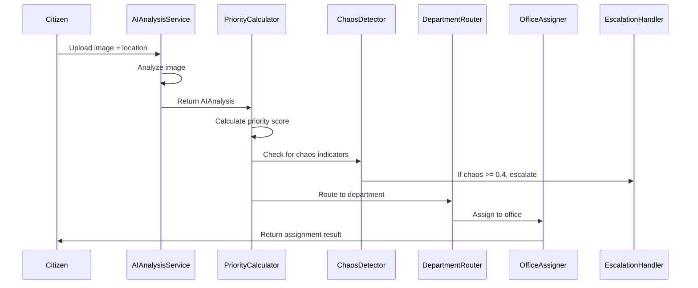

# Design Document: SevaSetu Hierarchical System

## Overview

The SevaSetu Hierarchical System is a comprehensive civic issue management solution that combines AI-powered image analysis, intelligent routing, and multi-factor prioritization. The system processes citizen-reported issues through an automated pipeline that categorizes, scores, and routes issues to the appropriate government department and office.

The architecture follows a modular design with clear separation between:
- AI Analysis Layer (image processing and categorization)
- Priority Calculation Layer (multi-factor scoring)
- Routing Layer (department and office assignment)
- Escalation Layer (emergency detection and handling)

## Architecture

```
┌─────────────────────────────────────────────────────────────────────────────┐
│                           SEVASETU HIERARCHICAL SYSTEM                       │
└─────────────────────────────────────────────────────────────────────────────┘

┌─────────────────┐     ┌─────────────────┐     ┌─────────────────┐
│   Issue Input   │────▶│  AI Analysis    │────▶│   Priority      │
│   (Image/Loc)   │     │  Service        │     │   Calculator    │
└─────────────────┘     └─────────────────┘     └─────────────────┘
                                                        │
                        ┌───────────────────────────────┤
                        │                               │
                        ▼                               ▼
                ┌─────────────────┐           ┌─────────────────┐
                │   Chaos         │           │   Department    │
                │   Detector      │           │   Router        │
                └─────────────────┘           └─────────────────┘
                        │                               │
                        ▼                               ▼
                ┌─────────────────┐           ┌─────────────────┐
                │   Escalation    │           │   Office        │
                │   Handler       │           │   Assigner      │
                └─────────────────┘           └─────────────────┘
```

### Component Interaction Flow



## Components and Interfaces

### 1. AIAnalysisService

Responsible for analyzing uploaded images using multi-modal AI (Google Gemini Vision or GPT-4 Vision).

```dart
abstract class AIAnalysisService {
  /// Analyzes an image and returns structured analysis
  Future<AIAnalysis> analyzeImage(String imageUrl);
  
  /// Validates that analysis result contains required fields
  bool validateAnalysis(AIAnalysis analysis);
}

class GeminiAIAnalysisService implements AIAnalysisService {
  final String apiKey;
  final String modelId;
  
  GeminiAIAnalysisService({required this.apiKey, this.modelId = 'gemini-pro-vision'});
  
  @override
  Future<AIAnalysis> analyzeImage(String imageUrl) async {
    // Send image to Gemini API with civic issue analysis prompt
    // Parse structured JSON response into AIAnalysis
  }
}
```

### 2. PriorityCalculator

Calculates comprehensive priority scores using weighted multi-factor algorithm.

```dart
class PriorityCalculator {
  /// Calculate comprehensive priority score (0-100)
  int calculatePriorityScore(CivicIssue issue, AIAnalysis? aiAnalysis);
  
  /// Calculate severity component (max 30 points)
  int calculateSeverityScore(String severityLevel);
  
  /// Calculate population impact component (max 25 points)
  int calculatePopulationScore(AIAnalysis analysis);
  
  /// Calculate category urgency component (max 15 points)
  int getCategoryUrgencyScore(String category);
  
  /// Calculate community support component (max 15 points)
  int calculateCommunityScore(int upvotes);
  
  /// Calculate time factor component (max 10 points)
  int calculateTimeScore(DateTime createdAt);
  
  /// Determine if issue qualifies as high priority
  bool isHighPriority(int priorityScore, AIAnalysis? aiAnalysis);
}
```

### 3. ChaosDetector

Identifies emergency and chaos situations from AI analysis.

```dart
class ChaosDetector {
  /// Calculate chaos score (0.0 to 1.0)
  double calculateChaosScore(AIAnalysis analysis);
  
  /// Check if specific hazard indicators are present
  bool hasHazard(AIAnalysis analysis, String hazardType);
  
  /// Get list of all detected hazards
  List<String> getDetectedHazards(AIAnalysis analysis);
}
```

### 4. DepartmentRouter

Maps issue categories to government departments.

```dart
enum Department { PWD, SANITATION, ELECTRICITY, WATER, GENERAL }

class DepartmentRouter {
  /// Map category to responsible department
  Department mapCategoryToDepartment(String category);
  
  /// Get all categories handled by a department
  List<String> getCategoriesForDepartment(Department department);
}
```

### 5. OfficeAssigner

Assigns issues to the nearest appropriate office.

```dart
class AssignmentResult {
  final Office office;
  final bool escalated;
  final double distance;
  
  AssignmentResult({required this.office, required this.escalated, required this.distance});
}

class OfficeAssigner {
  /// Assign issue to nearest office
  Future<AssignmentResult> assignIssue(CivicIssue issue, Department department);
  
  /// Find offices by department and district
  Future<List<Office>> findOffices(Department department, String district);
  
  /// Find state-level offices for escalation
  Future<List<Office>> findStateOffices(Department department, String state);
  
  /// Select nearest office by distance
  Office selectByDistance(List<Office> offices, GeoPoint location);
}
```

### 6. EscalationHandler

Manages emergency escalation through the hierarchy.

```dart
enum EscalationLevel { none, elevated, highPriority, emergency }

class EscalationHandler {
  /// Handle escalation based on chaos score
  Future<void> handleEscalation(CivicIssue issue, AIAnalysis analysis);
  
  /// Trigger emergency protocol (chaos >= 0.8)
  Future<void> triggerEmergencyProtocol(CivicIssue issue);
  
  /// Trigger high priority protocol (chaos >= 0.6)
  Future<void> triggerHighPriorityProtocol(CivicIssue issue);
  
  /// Flag for supervisor review (chaos >= 0.4)
  Future<void> flagForReview(CivicIssue issue);
  
  /// Determine escalation level from chaos score
  EscalationLevel getEscalationLevel(double chaosScore);
}
```

## Data Models

### AIAnalysis

```dart
class AIAnalysis {
  final String detectedCategory;
  final double confidenceScore;
  final String severityLevel;
  final double affectedAreaSqm;
  final String populationImpact;
  final List<String> hazardIndicators;
  final int recommendedPriority;
  final String analysisNotes;
  final DateTime analyzedAt;

  AIAnalysis({
    required this.detectedCategory,
    required this.confidenceScore,
    required this.severityLevel,
    required this.affectedAreaSqm,
    required this.populationImpact,
    required this.hazardIndicators,
    required this.recommendedPriority,
    required this.analysisNotes,
    required this.analyzedAt,
  });

  factory AIAnalysis.fromJson(Map<String, dynamic> json) {
    return AIAnalysis(
      detectedCategory: json['detected_category'] as String,
      confidenceScore: (json['confidence_score'] as num).toDouble(),
      severityLevel: json['severity_level'] as String,
      affectedAreaSqm: (json['affected_area_sqm'] as num).toDouble(),
      populationImpact: json['population_impact'] as String,
      hazardIndicators: List<String>.from(json['hazard_indicators'] ?? []),
      recommendedPriority: json['recommended_priority'] as int,
      analysisNotes: json['analysis_notes'] as String? ?? '',
      analyzedAt: DateTime.parse(json['analyzed_at'] as String),
    );
  }

  Map<String, dynamic> toJson() {
    return {
      'detected_category': detectedCategory,
      'confidence_score': confidenceScore,
      'severity_level': severityLevel,
      'affected_area_sqm': affectedAreaSqm,
      'population_impact': populationImpact,
      'hazard_indicators': hazardIndicators,
      'recommended_priority': recommendedPriority,
      'analysis_notes': analysisNotes,
      'analyzed_at': analyzedAt.toIso8601String(),
    };
  }
}
```

### CivicIssue

```dart
class CivicIssue {
  final String id;
  final String category;
  final String description;
  final String imageUrl;
  final GeoPoint location;
  final String district;
  final String state;
  final int upvotes;
  final DateTime createdAt;
  final IssueStatus status;
  final AIAnalysis? aiAnalysis;
  final int priorityScore;
  final bool isHighPriority;

  CivicIssue({
    required this.id,
    required this.category,
    required this.description,
    required this.imageUrl,
    required this.location,
    required this.district,
    required this.state,
    this.upvotes = 0,
    required this.createdAt,
    this.status = IssueStatus.pending,
    this.aiAnalysis,
    this.priorityScore = 0,
    this.isHighPriority = false,
  });
}

enum IssueStatus { pending, assigned, inProgress, resolved, escalated }

class GeoPoint {
  final double latitude;
  final double longitude;
  
  GeoPoint({required this.latitude, required this.longitude});
  
  double distanceTo(GeoPoint other) {
    // Haversine formula for distance calculation
  }
}
```

### Office

```dart
class Office {
  final String id;
  final String name;
  final Department department;
  final String district;
  final String state;
  final GeoPoint location;
  final bool isStateLevel;

  Office({
    required this.id,
    required this.name,
    required this.department,
    required this.district,
    required this.state,
    required this.location,
    this.isStateLevel = false,
  });
}
```

### PriorityZone

```dart
enum PriorityZone {
  criticalInfrastructure,  // Hospitals, fire stations, police
  educationalZone,         // Schools, colleges
  commercialHub,           // Markets, business districts
  residentialDense,        // Apartment complexes
  residentialSparse,       // Individual houses
  industrial,              // Factories, warehouses
  rural,                   // Village areas
}
```


## Correctness Properties

*A property is a characteristic or behavior that should hold true across all valid executions of a system—essentially, a formal statement about what the system should do. Properties serve as the bridge between human-readable specifications and machine-verifiable correctness guarantees.*

### Property 1: Priority Score Bounds

*For any* CivicIssue and optional AIAnalysis, the calculated priority score SHALL always be within the range [0, 100].

**Validates: Requirements 4.1, 4.8**

### Property 2: Department Routing Totality and Determinism

*For any* valid issue category (POTHOLE, GARBAGE, STREETLIGHT, WATER_LEAK, SEWAGE_OVERFLOW, DRAINAGE_PROBLEM, POWER_CUT, OTHER), the DepartmentRouter SHALL return exactly one department, and the same category SHALL always map to the same department.

**Validates: Requirements 2.1, 2.2, 2.3, 2.4, 2.5, 2.6**

### Property 3: Severity Score Determinism

*For any* severity level, the calculateSeverityScore function SHALL return:
- 30 for CRITICAL
- 24 for HIGH
- 15 for MEDIUM
- 8 for LOW
- 10 for unknown/default

**Validates: Requirements 5.1, 5.2, 5.3, 5.4, 5.5**

### Property 4: Population Score Bounds

*For any* AIAnalysis with any population impact level and location multiplier, the calculated population score SHALL never exceed 25 points.

**Validates: Requirements 6.1, 6.2, 6.3, 6.4, 6.8**

### Property 5: Category Urgency Score Determinism

*For any* issue category, the getCategoryUrgencyScore function SHALL return a deterministic value:
- POWER_CUT → 15
- WATER_LEAK, SEWAGE_OVERFLOW → 14
- POTHOLE → 12
- DRAINAGE_PROBLEM → 11
- STREETLIGHT → 10
- GARBAGE → 8
- OTHER/unknown → 6

**Validates: Requirements 7.1, 7.2, 7.3, 7.4, 7.5, 7.6, 7.7**

### Property 6: Community Score Logarithmic Scaling with Cap

*For any* upvote count:
- If upvotes ≤ 0, score = 0
- If 1 ≤ upvotes ≤ 5, score = upvotes
- If 6 ≤ upvotes ≤ 20, score = 5 + floor((upvotes - 5) * 0.5)
- If 21 ≤ upvotes ≤ 100, score = 12 + floor((upvotes - 20) * 0.1)
- If upvotes > 100, score = 15 (capped)

The score SHALL never exceed 15.

**Validates: Requirements 8.1, 8.2, 8.3, 8.4, 8.5**

### Property 7: Time Score Age-Based Rules

*For any* issue creation timestamp, the calculateTimeScore function SHALL return:
- 10 if age < 24 hours
- 8 if 1 ≤ age < 3 days
- 6 if 3 ≤ age < 7 days
- 7 if 7 ≤ age < 14 days
- 8 if 14 ≤ age < 30 days
- 10 if age ≥ 30 days

**Validates: Requirements 9.1, 9.2, 9.3, 9.4, 9.5, 9.6**

### Property 8: Chaos Score Bounds

*For any* AIAnalysis, the calculated chaos score SHALL always be within the range [0.0, 1.0].

**Validates: Requirements 10.1, 10.11**

### Property 9: Escalation Level Thresholds

*For any* chaos score:
- If chaosScore ≥ 0.8, escalation level = emergency
- If 0.6 ≤ chaosScore < 0.8, escalation level = highPriority
- If 0.4 ≤ chaosScore < 0.6, escalation level = elevated
- If chaosScore < 0.4, escalation level = none

**Validates: Requirements 11.1, 11.2, 11.3**

### Property 10: Priority Zone Bonus Determinism

*For any* PriorityZone, the getZonePriorityBonus function SHALL return:
- criticalInfrastructure → 20
- educationalZone → 15
- commercialHub → 12
- residentialDense → 10
- industrial → 8
- residentialSparse → 5
- rural → 3

**Validates: Requirements 12.1, 12.2, 12.3, 12.4, 12.5, 12.6, 12.7**

### Property 11: High Priority Determination

*For any* issue with priority score and optional AIAnalysis:
- If priorityScore > 70, isHighPriority = true
- If aiAnalysis.severityLevel == 'CRITICAL', isHighPriority = true
- If chaosScore ≥ 0.7, isHighPriority = true
- Otherwise, isHighPriority = false

**Validates: Requirements 13.1, 13.2, 13.3**

### Property 12: Nearest Office Selection

*For any* non-empty list of offices and a target location, the selectByDistance function SHALL return the office with the minimum distance to the target location.

**Validates: Requirements 3.2**

### Property 13: Escalated Assignment Marking

*For any* assignment that uses state-level offices (when no district offices exist), the AssignmentResult SHALL have escalated = true.

**Validates: Requirements 3.4**

### Property 14: AIAnalysis JSON Round-Trip

*For any* valid AIAnalysis object, serializing to JSON and then deserializing SHALL produce an equivalent AIAnalysis object.

**Validates: Requirements 14.10**

### Property 15: Component Score Bounds

*For any* priority calculation:
- Severity component SHALL be ≤ 30
- Population component SHALL be ≤ 25
- Category urgency component SHALL be ≤ 15
- Community support component SHALL be ≤ 15
- Time factor component SHALL be ≤ 10
- AI confidence bonus SHALL be ≤ 5

**Validates: Requirements 4.2, 4.3, 4.4, 4.5, 4.6, 4.7**

## Error Handling

### AI Analysis Failures

```dart
class AIAnalysisException implements Exception {
  final String message;
  final String? imageUrl;
  
  AIAnalysisException(this.message, {this.imageUrl});
}

// Fallback when AI analysis fails
AIAnalysis createDefaultAnalysis(String manualCategory) {
  return AIAnalysis(
    detectedCategory: manualCategory,
    confidenceScore: 0.0,  // Indicates manual entry
    severityLevel: 'MEDIUM',  // Default severity
    affectedAreaSqm: 0.0,
    populationImpact: 'MEDIUM',  // Default impact
    hazardIndicators: [],
    recommendedPriority: 50,  // Middle priority
    analysisNotes: 'Manual category selection - AI analysis unavailable',
    analyzedAt: DateTime.now(),
  );
}
```

### Office Assignment Failures

```dart
class NoOfficeAvailableException implements Exception {
  final Department department;
  final String district;
  final String state;
  
  NoOfficeAvailableException({
    required this.department,
    required this.district,
    required this.state,
  });
}

// If no offices found even at state level, escalate to admin
Future<AssignmentResult> handleNoOfficeScenario(CivicIssue issue) async {
  // Log critical error
  // Notify state admin
  // Return placeholder assignment for manual handling
}
```

### Invalid Input Handling

```dart
// Validate category before routing
String validateCategory(String category) {
  const validCategories = [
    'POTHOLE', 'GARBAGE', 'STREETLIGHT', 'WATER_LEAK',
    'SEWAGE_OVERFLOW', 'DRAINAGE_PROBLEM', 'POWER_CUT', 'OTHER'
  ];
  
  if (validCategories.contains(category.toUpperCase())) {
    return category.toUpperCase();
  }
  return 'OTHER';  // Default to OTHER for invalid categories
}

// Validate severity level
String validateSeverityLevel(String severity) {
  const validLevels = ['LOW', 'MEDIUM', 'HIGH', 'CRITICAL'];
  
  if (validLevels.contains(severity.toUpperCase())) {
    return severity.toUpperCase();
  }
  return 'MEDIUM';  // Default to MEDIUM for invalid levels
}
```

## Testing Strategy

### Unit Tests

Unit tests verify specific examples and edge cases:

1. **PriorityCalculator Tests**
   - Test each scoring component with specific inputs
   - Test edge cases (0 upvotes, very old issues, unknown categories)
   - Test boundary conditions (score at 0, score at 100)

2. **DepartmentRouter Tests**
   - Test each category-to-department mapping
   - Test invalid category handling

3. **ChaosDetector Tests**
   - Test chaos score calculation with various hazard combinations
   - Test boundary values (0.0, 0.4, 0.6, 0.8, 1.0)

4. **OfficeAssigner Tests**
   - Test nearest office selection with known distances
   - Test escalation when no district offices exist

### Property-Based Tests

Property-based tests verify universal properties across many generated inputs using the `test` package with `dart_check` for property-based testing.

**Configuration:**
- Minimum 100 iterations per property test
- Each test tagged with feature and property reference

**Test File Structure:**
```dart
// test/hierarchical_system/priority_calculator_property_test.dart

import 'package:dart_check/dart_check.dart';
import 'package:test/test.dart';

void main() {
  group('PriorityCalculator Properties', () {
    // Feature: sevasetu-hierarchical-system, Property 1: Priority Score Bounds
    test('priority score is always within [0, 100]', () {
      check(
        'for all issues and analyses',
        forAll(civicIssueGenerator, aiAnalysisGenerator, (issue, analysis) {
          final score = calculator.calculatePriorityScore(issue, analysis);
          return score >= 0 && score <= 100;
        }),
      );
    });
  });
}
```

**Property Test Coverage:**

| Property | Test File | Description |
|----------|-----------|-------------|
| Property 1 | priority_calculator_property_test.dart | Score bounds [0, 100] |
| Property 2 | department_router_property_test.dart | Routing totality and determinism |
| Property 3 | priority_calculator_property_test.dart | Severity score determinism |
| Property 4 | priority_calculator_property_test.dart | Population score bounds |
| Property 5 | priority_calculator_property_test.dart | Category urgency determinism |
| Property 6 | priority_calculator_property_test.dart | Community score scaling |
| Property 7 | priority_calculator_property_test.dart | Time score rules |
| Property 8 | chaos_detector_property_test.dart | Chaos score bounds |
| Property 9 | escalation_handler_property_test.dart | Escalation thresholds |
| Property 10 | priority_calculator_property_test.dart | Zone bonus determinism |
| Property 11 | priority_calculator_property_test.dart | High priority determination |
| Property 12 | office_assigner_property_test.dart | Nearest office selection |
| Property 13 | office_assigner_property_test.dart | Escalated assignment marking |
| Property 14 | ai_analysis_property_test.dart | JSON round-trip |
| Property 15 | priority_calculator_property_test.dart | Component score bounds |

### Test Data Generators

```dart
// Generators for property-based testing

Generator<String> severityLevelGenerator = oneOf([
  constant('LOW'),
  constant('MEDIUM'),
  constant('HIGH'),
  constant('CRITICAL'),
]);

Generator<String> categoryGenerator = oneOf([
  constant('POTHOLE'),
  constant('GARBAGE'),
  constant('STREETLIGHT'),
  constant('WATER_LEAK'),
  constant('SEWAGE_OVERFLOW'),
  constant('DRAINAGE_PROBLEM'),
  constant('POWER_CUT'),
  constant('OTHER'),
]);

Generator<AIAnalysis> aiAnalysisGenerator = combine4(
  doubleInRange(0.0, 1.0),  // confidenceScore
  severityLevelGenerator,
  populationImpactGenerator,
  listOf(hazardIndicatorGenerator),
  (confidence, severity, population, hazards) => AIAnalysis(
    detectedCategory: categoryGenerator.generate(),
    confidenceScore: confidence,
    severityLevel: severity,
    affectedAreaSqm: doubleInRange(0.0, 1000.0).generate(),
    populationImpact: population,
    hazardIndicators: hazards,
    recommendedPriority: intInRange(0, 100).generate(),
    analysisNotes: '',
    analyzedAt: DateTime.now(),
  ),
);
```
